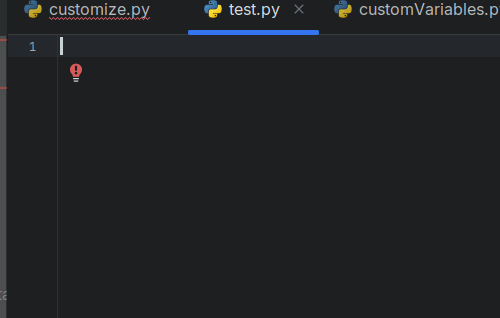

# Gaffer-Python-Stubs
Python stubs to get some autocompletion and suggestions for Gaffer's Python modules in IDEs 



# Using
Clone the repo and point your IDEs autocomplete paths to the ***stubs*** folder.

If you are using pycharm, add the stubs folder to the source folders in your project settings.

# Generating
To generate stubs yourself , edit the *target* variable in the generate_stubs.py file and execute it from Gaffer's Python editor  with :

```Python
exec(open('......../Gaffer-Python-Stubs/generate_stubs.py').read())
```

# Todo
It would be nice to get some better argument hints for class methods instead of just *(self, \*args, \*\*kwargs)*, but would need to find a way to get them, as inspect does not work well on C/Boost modules.

# Copyright and license

© 2011–2020 John Haddon. All rights reserved.

© 2011–2020 Image Engine Design Inc. All rights reserved.

© 2011–2020 Cinesite VFX Ltd. All rights reserved.

Distributed under the BSD license.
